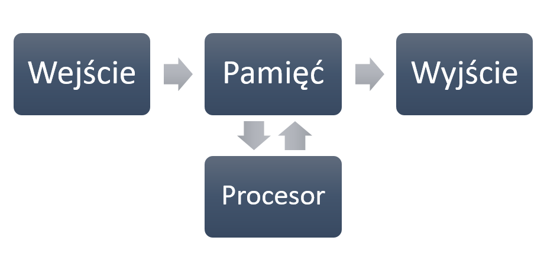
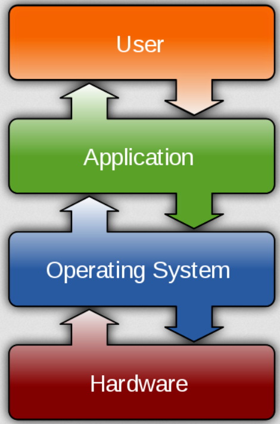

# Programowanie w pracy naukowca
## Kurs podstawowy

---

# O mnie

* k.basinski@gumed.edu.pl
* Krzysztof Basiński
* Zakład Badań nad Jakością Życia
* Tuwima 15, pok. 312

---

# O tym przedmiocie

* Dwie części - kurs podstawowy i zaawansowany
* Fakultet do wyboru
* 15h, 7 spotkań i godzina ekstra

---

# Kurs podstawowy

* "Od zera do bohatera"
* Nie musisz znać się na programowaniu
* Musisz znać **absolutne podstawy** informatyki: co to jest plik, co to jest folder, jak się kopiuje pliki, zmienia im nazwy itd.

---

# Kurs zaawansowany

* Dla tych, którzy zrobili kurs podstawowy albo mają background programistyczny
* Skupimy się na **zastosowaniach** programowania w pracy naukowej:
	* Analiza danych (raczej nie statystyka)
	* Wizualizacje
	* Tworzenie reprodukowalnych analiz 

---

# Reguły gry

* Obecność na zajęciach (można raz nie być)
* Kamery!
* 7 zadań, co tydzień nowe
* **Ostateczny** termin oddania wszystkich zadań - tydzień po ostatnich zajęciach kursu podstawowego

---

# Jak działają komputery?

---

# Komputer == kalkulator

---

# Wejście i wyjście

---

# Dane wejściowe

* Klawiatura
* Myszka
* Touchpad?
* Plik na dysku
* Dane zdalne, uzyskane przez sieć
* etc.

---

# Pamięć

* RAM - Random Access Memory
* Pamięć "chwilowa" - informacje zapisywane na moment, po to by CPU wykonał operacje

---

# Procesor (CPU)

* Bardzo szybki kalkulator
* Jak szybki?
* Ok. 50 miliardów operacji na sekundę w nowoczesnym laptopie

---

# Dane wyjściowe

* Ekran
* Plik
* Słuchawki bluetooth
* Adresat e-maila
* etc.

---

# Bit

* Podstawowa jednostka informacji
* Przyjmuje wartości **0 lub 1**
* Ciąg ośmiu bitów daje jeden **bajt** - najprostszy sposób zapisania np. pojedynczego znaku
* <https://en.wikipedia.org/wiki/Bit>

---

---

# ASCII

* Siedem bitów
* Np. `011 1001` - cyfra *9*
* Np. `100 0001` - litera *A*
* Np. `010 0000` - spacja
* Jeden z możliwych standardów kodowania znaków

---

# UTF-8

* Złoty standard kodowania znaków
* 1,112,064 możliwych znaków
* od 8 do 32 bitów
* Dobra rada - jeśli możesz, **zawsze używaj kodowania UTF-8**
* Programy firmy Microsoft uporczywie *nie używają* kodowania UTF-8

---

# Bajty

- Osiem bitów daje jeden bajt
- Dokładając przedrostek (z układu SI), dostajemy znane jednostki
    + **KILO**bajty (1,000 bajtów)
    + **MEGA**bajty (1,000,000 bajtów)
    + **GIGA**bajty (1,000,000,000 bajtów)
    + **TERA**bajty (1,000,000,000,000 bajtów)

---

# Programy

* Skąd procesor wie, jakiego rodzaju operacje ma wykonać na danych?
* Mówi mu to ciąg instrukcji zwany **programem**
* Program komputerowy działa tak samo jak programator w pralce
* Aby CPU zrozumiał program, musi on być napisany w **kodzie maszynowym**

---

# Kod maszynowy

    8B542408 83FA0077 06B80000 0000C383
    FA027706 B8010000 00C353BB 01000000
    B9010000 008D0419 83FA0376 078BD989
    C14AEBF1 5BC3

---

# Assembler

    fib:
    mov edx, [esp+8]
    cmp edx, 0
    ja @f
    mov eax, 0
    ret

    @@:
    cmp edx, 2
    ja @f
    mov eax, 1
    ret

    @@:
    push ebx
    mov ebx, 1
    mov ecx, 1

    @@:
        lea eax, [ebx+ecx]
        cmp edx, 3
        jbe @f
        mov ebx, ecx
        mov ecx, eax
        dec edx
    jmp @b

    @@:
    pop ebx
    ret

---

# C

    unsigned int fib(unsigned int n) {
    if (n <= 0)
        return 0;
    else if (n <= 2)
        return 1;
    else {
        unsigned int a,b,c;
        a = 1;
        b = 1;
        while (1) {
            c = a + b;
            if (n <= 3) return c;
            a = b;
            b = c;
            n--;
        }
      }
    }

---

# Języki programowania wysokiego/wyższego poziomu

* **Python**
* Java
* Ruby
* Pearl
* R

---

# System operacyjny (OS)

* *Program do uruchamiania programów*
* Komunikuje się z *hardwarem*
* Zapewnia podstawowe funkcjonalności:
    + I/O
    + Sieć
    + Dostęp do danych na dysku
* Programy piszę się pod konkretny OS

---

# Systemy operacyjne

---

---

# Systemy operacyjne - Windows

---

# Systemy operacyjne - MacOS

---

# Systemy operacyjne - Linux

---

# Python

---

# Python - co to takiego?

* interpretowany język programowania wysokiego poziomu
* że co?

---

# Python - co to takiego?

* interpretowany: nie potrzebujemy kompilować programów
* interpretowany: potrzebujemy mieć interpreter Pythona zainstalowany na komputerze
* wysokiego poziomu: nie trzeba przejmować się alokacją pamięci, deklarowaniem zmiennych, itd.
* jeśli masz znać jeden język programowania, naucz się Pythona

---

# Python - do czego służy?

* Do wszystkiego
* Głównie zastosowania:
     * aplikacje webowe
     * data science
     * uczenie maszynowe
     * skryptowanie

---

# Guido van Rossum (1991)

---

# Wersje Pythona

* Python 2 skończył swój żywot w 2020r., dalej możecie się natknąć na przykłady i tutoriale
* My uczymy się tylko Pythona 3 (3.8)

---

# Skrypty a programowanie interaktywne

* Klasyczne programowanie polega na pisaniu skryptów/programów - plików tekstowych, na których pracuje interpreter/kompilator
* Taki też jest klasyczny sposób pracy z Pythonem
* My będziemy uczyć się **programowania interaktywnego** - piszesz kod i od razu widzisz jego rezultat

---

# Chcesz spróbować? Potrzebujesz tylko przeglądarki

<https://www.pythonanywhere.com>

---

# Jupyter Notebook

* _Notes_, służący do programowania interaktywnego
* Składa się z komórek (_cells_), zawierających kod programistyczny i tekst w Markdown (_rich text_)
* Jupyter wspiera wiele języków programowania (_language agnostic_), ale my będziemy korzystać z Pythona

---

# Jupyter Lab

* Aplikacja, która w jednym miejscu skupia przeglądarke plików, Notebook, konsolę, terminale i wiele innych fajnych rzeczy
* Działa wewnątrz przeglądarki internetowej (zdalnie na serwerze albo lokalnie)
* Obecnie stabilna wersja 3.0

---

# Jupyter Lab lokalnie

<https://www.anaconda.com/distribution/>

---

# Praca zdalna - Google Collaboratory

<https://colab.research.google.com>

---

# Skąd wziąć pomoc?

- <https://docs.python.org/3/>
- <https://jupyterlab.readthedocs.io/en/stable/>
- <https://python.swaroopch.com>
- <https://colab.research.google.com/notebooks/>
- Strona przedmiotu i moje screencasty <http://kbas.gumed.edu.pl/programowanie_psd/>

---

# Tutoriale

<https://www.codecademy.com/learn/learn-python-3>
<https://www.udemy.com/learn-python-programming-and-cryptocurrency-data-analysis/?src=sac&kw=python>
<https://www.datacamp.com>
<https://youtube.com/>