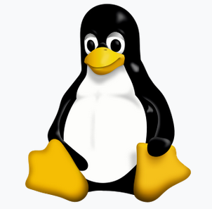

### O mnie

- k.basinski@gumed.edu.pl
- Krzysztof Basiński
- Zakład Badań nad Jakością Życia
- Tuwima 15, pok. 312

### O tym przedmiocie

- Dwie części - kurs podstawowy i zaawansowany
- Fakultet do wyboru
- 15h, 5 spotkań

### Kurs podstawowy

- "Od zera do bohatera"
- Nie musisz znać się na programowaniu
- Musisz znać **absolutne podstawy** informatyki: co to jest plik, co to jest folder, jak się kopiuje pliki, zmienia im nazwy itd.

### Kurs zaawansowany

- Dla tych, którzy zrobili kurs podstawowy albo mają background programistyczny
- Skupimy się na **zastosowaniach** programowania w pracy naukowej:
	- Analiza danych i statystyka
	- Wizualizacje
	- Tworzenie reprodukowalnych analiz 

### Jak działają komputery?

### Komputer == kalkulator

### Wejście i wyjście

### Dane wejściowe

- Klawiatura
- Myszka
- Touchpad?
- Plik na dysku
- Dane zdalne, uzyskane przez sieć
- etc.

### Pamięć

- RAM - Random Access Memory
- Pamięć "chwilowa" - informacje zapisywane na moment, po to by CPU wykonał operacje

### Procesor (CPU)

- Bardzo szybki kalkulator
- Jak szybki?
- Ok. 50 miliardów operacji na sekundę w nowoczesnym laptopie

### Dane wyjściowe

- Ekran
- Plik
- Słuchawki bluetooth
- Adresat e-maila
- etc.

### Bit

- Podstawowa jednostka informacji
- Przyjmuje wartości **0 lub 1**
- Ciąg ośmiu bitów daje jeden **bajt** - najprostszy sposób zapisania np. pojedynczego znaku

### ASCII

- Siedem bitów
- Np. `011 1001` - cyfra *9*
- Np. `100 0001` - litera *A*
- Np. `010 0000` - spacja
- Jeden z możliwych standardów kodowania znaków

### UTF-8

- Złoty standard kodowania znaków
- 1,112,064 możliwych znaków
- od 8 do 32 bitów
- Dobra rada - jeśli możesz, **zawsze używaj kodowania UTF-8**
- Programy firmy Microsoft uporczywie *nie używają* kodowania UTF-8

### Bajty

- Osiem bitów daje jeden bajt
- Dokładając przedrostek (z układu SI), dostajemy znane jednostki
    + **KILO**bajty (1,000 bajtów)
    + **MEGA**bajty (1,000,000 bajtów)
    + **GIGA**bajty (1,000,000,000 bajtów)
    + **TERA**bajty (1,000,000,000,000 bajtów)

### Programy

- Skąd procesor wie, jakiego rodzaju operacje ma wykonać na danych?
- Mówi mu to ciąg instrukcji zwany **programem**
- Program komputerowy działa tak samo jak programator w pralce
- Aby CPU zrozumiał program, musi on być napisany w **kodzie maszynowym**

### Kod maszynowy

    8B542408 83FA0077 06B80000 0000C383
    FA027706 B8010000 00C353BB 01000000
    B9010000 008D0419 83FA0376 078BD989
    C14AEBF1 5BC3

### Assembler

    fib:
    mov edx, [esp+8]
    cmp edx, 0
    ja @f
    mov eax, 0
    ret

    @@:
    cmp edx, 2
    ja @f
    mov eax, 1
    ret

    @@:
    push ebx
    mov ebx, 1
    mov ecx, 1

    @@:
        lea eax, [ebx+ecx]
        cmp edx, 3
        jbe @f
        mov ebx, ecx
        mov ecx, eax
        dec edx
    jmp @b

    @@:
    pop ebx
    ret

### C

    unsigned int fib(unsigned int n) {
    if (n <= 0)
        return 0;
    else if (n <= 2)
        return 1;
    else {
        unsigned int a,b,c;
        a = 1;
        b = 1;
        while (1) {
            c = a + b;
            if (n <= 3) return c;
            a = b;
            b = c;
            n--;
        }
      }
    }

### Języki programowania wysokiego/wyższego poziomu

- **Python**
- Java
- Ruby
- Pearl
- R

### System operacyjny (OS)

- *Program do uruchamiania programów*
- Komunikuje się z *hardwarem*
- Zapewnia podstawowe funkcjonalności:
    + I/O
    + Sieć
    + Dostęp do danych na dysku
- Programy piszę się pod konkretny OS

### Systemy operacyjne

### Systemy operacyjne - Windows

### Systemy operacyjne - MacOS

### Systemy operacyjne - Linux

### Python

### Python - co to takiego?

- interpretowany język programowania wysokiego poziomu
- że co?

### Python - co to takiego?

- interpretowany: nie potrzebujemy kompilować programów
- interpretowany: potrzebujemy mieć interpreter Pythona zainstalowany na komputerze
- wysokiego poziomu: nie trzeba przejmować się alokacją pamięci, deklarowaniem zmiennych, itd.
- jeśli masz znać jeden język programowania, naucz się Pythona

### Python - do czego służy?

- Do wszystkiego
- Głównie zastosowania:
     - aplikacje webowe
     - data science
     - uczenie maszynowe
     - skryptowanie

### Guido van Rossum (1991)

### Wersje Pythona

- Python 2 ma skończyć swój żywot w 2020r., dalej możecie się natknąć na przykłady i tutoriale
- My uczymy się tylko Pythona 3 (3.7)

### Skrypty a programowanie interaktywne

- Klasyczne programowanie polega na pisaniu skryptów/programów - plików tekstowych, na których pracuje interpreter/kompilator
- Taki też jest klasyczny sposób pracy z Pythonem
- My będziemy uczyć się **programowania interaktywnego** - piszesz kod i od razu widzisz jego rezultat

### Jupyter Notebook

- _Notes_, służący do programowania interaktywnego
- Składa się z komórek (_cells_), zawierających kod programistyczny i tekst w Markdown
- Jupyter wspiera wiele języków programowania, ale my będziemy korzystać z Pythona

### Jupyter Lab

- Aplikacja, która w jednym miejscu skupia przeglądarke plików, Notebook, konsolę, terminale i wiele innych fajnych rzeczy
- Działa wewnątrz przeglądarki internetowej (zdalnie albo lokalnie)
- Obecnie stabilna wersja 1.1

### Jupyter Lab zdalnie

<https://notebooks.ai/>

### Jupyter Lab lokalnie

<https://www.anaconda.com/distribution/>

### Chcesz spróbować? Potrzebujesz tylko przeglądarki

<https://www.pythonanywhere.com>

### Skąd wziąć pomoc?

<https://docs.python.org/3/>
<https://jupyterlab.readthedocs.io/en/stable/>
<https://python.swaroopch.com>

### Tutoriale

<https://www.codecademy.com/learn/learn-python-3>
<https://www.udemy.com/learn-python-programming-and-cryptocurrency-data-analysis/?src=sac&kw=python>
<https://www.datacamp.com>
<https://youtube.com/>